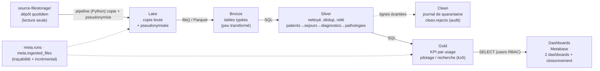

# 04 · Architecture cible

## Trajectoire — patron « médaillon », ELT (transfo dans l'entrepôt)

## Rôle de chaque couche

| Couche | Rôle | Support |
|---|---|---|
| **Lake** | copie brute, telle quelle (mais pseudonymisée pour patients/séjours) | fichiers sur disque `data/lake/` |
| **Bronze** | tables typées, peu transformées, 1 table par source | ClickHouse `bronze.*` |
| **Clean** | journal de quarantaine des lignes écartées — artefact opérationnel d'audit, **non analytique** (alimenté pendant l'étape silver) | ClickHouse `clean.rejects` |
| **Silver** | nettoyé, cohérent, dédupliqué, **relié** : `patients → sejours → diagnostics → pathologies` ; `monitoring` = flux autonome | ClickHouse `silver.*` |
| **Gold** | indicateurs agrégés **par usage** | ClickHouse `gold.*` (dims/fact = tables, KPI = vues) |

## Stack (tourne sur un laptop)

| Besoin | Choix | Justification |
|---|---|---|
| Entrepôt | **ClickHouse** (Docker, `:8123/play`) | warehouse colonne, partitionnement, UI SQL intégrée, tient le volume monitoring |
| Ingestion / orchestration | **Python** (CLI `eds`, `uv`) | recopie les fichiers + envoie le SQL ; **ne sort pas la donnée du moteur** |
| Planification | **cron** + `Makefile` | simple, rejouable, aucune infra supplémentaire |
| Restitution | **Metabase** (Docker, `:3000`) | dashboards sans code, groupes/permissions pour le cloisonnement |

## Principe à respecter

> La transformation **bronze → silver → gold s'exécute dans ClickHouse, en SQL**.
> Python **pilote** (copie + envoi des requêtes). On ne sort pas les données du
> moteur pour les transformer en mémoire (pandas) — anti-pattern Big Data classique.

## Alternatives écartées (à mentionner dans le dossier — « limites & recommandations »)

- **dbt-clickhouse** pour les transfos : meilleure gestion des dépendances, tests et
  doc auto ; écarté ici pour rester au plus près de la fiche-sujet (SQL + Python) et
  limiter les dépendances. Skills externes repérés : `dbt-labs/dbt-agent-skills`,
  `VoltAgent/awesome-claude-code-subagents` (data-engineer), Altimate skills.
- **Dagster / Airflow** : UI, retries et backfill natifs ; écarté (lourd pour un laptop,
  cron + table de runs suffit pour la démonstration).
- **Superset** au lieu de Metabase : row-level security plus fine ; écarté pour la
  simplicité de mise en place.
