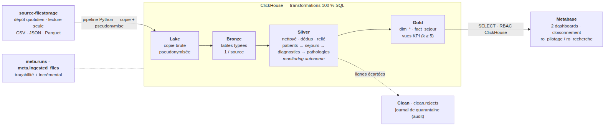
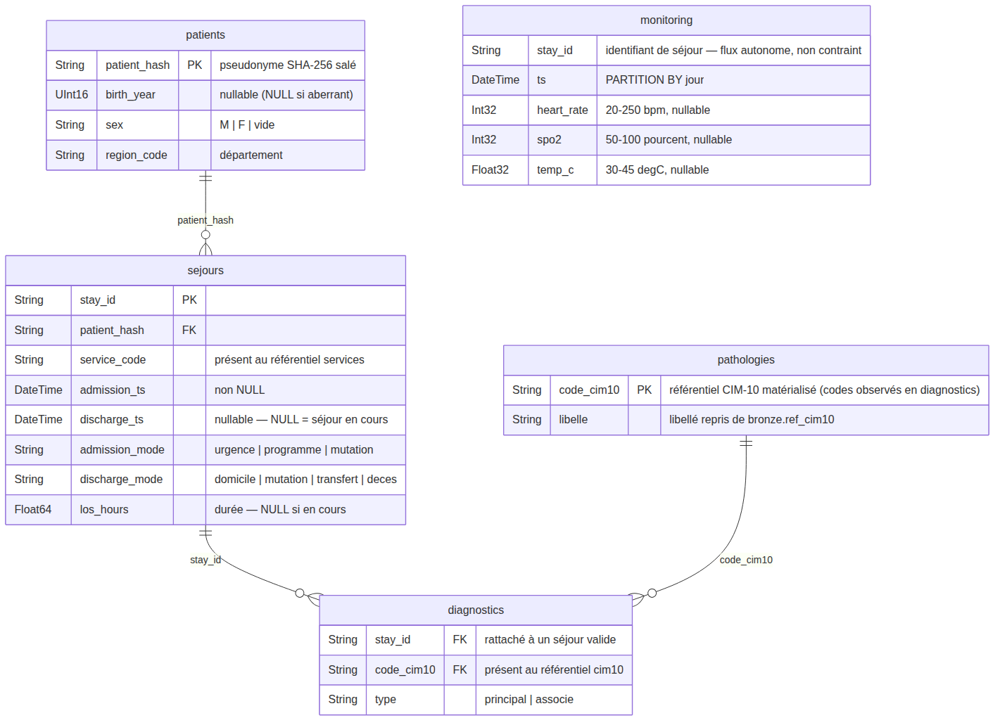
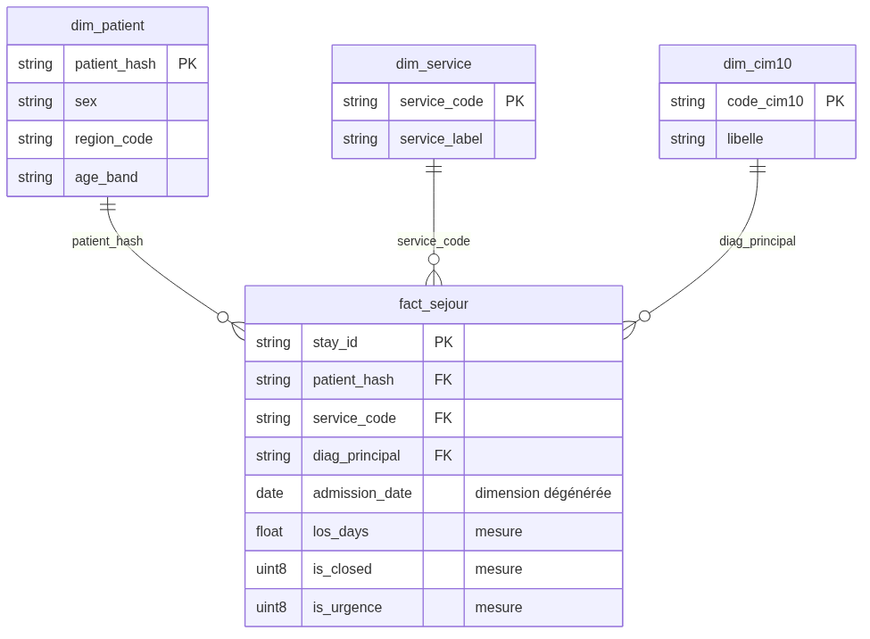
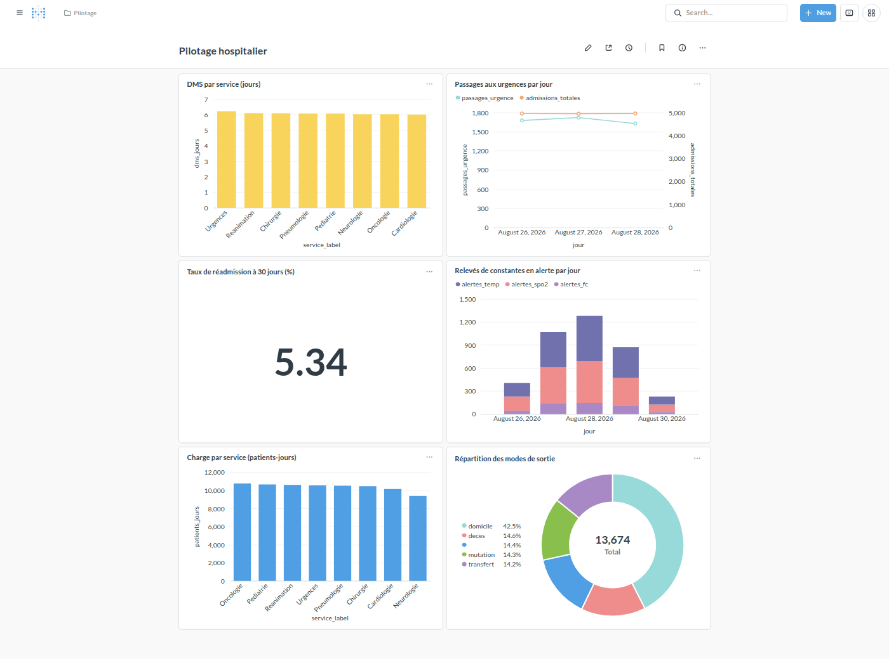
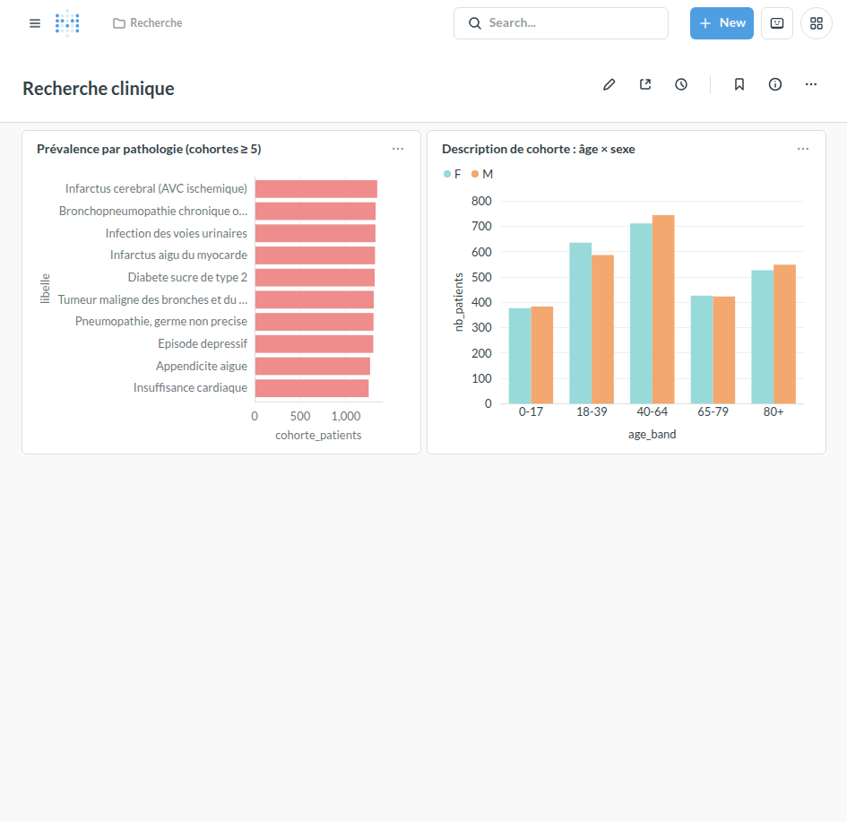
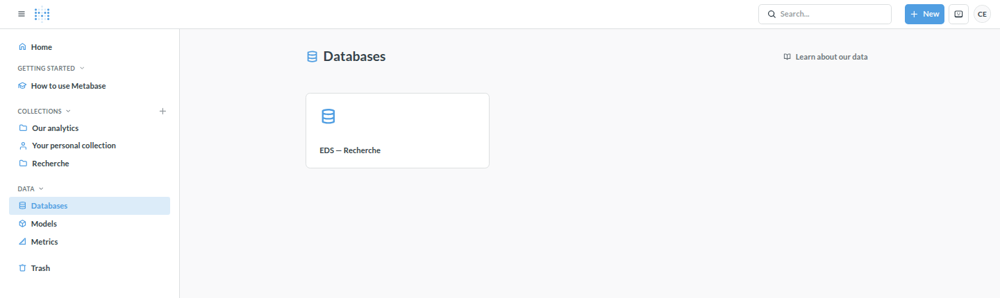
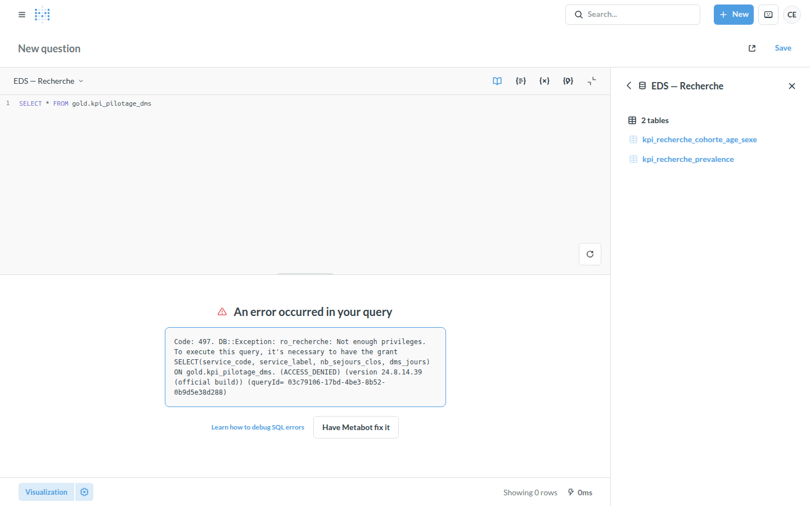

# Entrepôt de Données de Santé du CHU

Dossier d'architecture et de traitements — pipeline ELT médaillon sur ClickHouse, restitution Metabase, automatisation tracée.

```kpi
Sources | 6
Jours ingérés | 28
Séjours fiables | 6 729
Patients | 6 000
Contrôles verify | 9/9
```

## 1. Le besoin

Le CHU souhaite se doter d'un **Entrepôt de Données de Santé (EDS)**. Ses données sont aujourd'hui éparpillées dans plusieurs systèmes (dossier patient, urgences, laboratoire, monitoring des chambres) et exportées **chaque jour** sous forme de fichiers, dans des formats hétérogènes. La direction veut en tirer **deux usages** :

| Public | Ce qu'il attend |
|---|---|
| **Pilotage hospitalier** | Durée Moyenne de Séjour par service, activité des urgences, taux de réadmission à 30 jours, relevés de constantes en alerte, charge par service |
| **Recherche clinique** | prévalence par pathologie (taille des cohortes), description de cohorte par âge et sexe |

Les données de santé relèvent d'une **catégorie particulière** (RGPD, art. 9) : la conformité n'est pas une option mais une **contrainte de conception** présente à chaque étape. Les indicateurs doivent être **fiables, cohérents avec les sources et justifiables**.

## 2. Les sources

Le CHU dépose chaque jour ses fichiers dans `source-filestorage/<source>/<AAAA-MM-JJ>/`, en **lecture seule**. Volumétries constatées sur le jeu fourni : **28 jours** d'activité (2026-08-01 à 28) pour les séjours, diagnostics et monitoring ; les `patients` sont livrés en **3 instantanés complets** (2026-08-26 à 28).

| Fichier | Format | Volumétrie | Particularité |
|---|---|---|---|
| `patients.csv` | CSV | 6 000 lignes × 3 instantanés | contient l'identité réelle (NIR, nom, prénom) — à pseudonymiser |
| `sejours.csv` | CSV | 6 797 séjours (≈ 40 à 310 / jour) | `discharge_ts` parfois vide = séjour en cours |
| `diagnostics.json` | JSON imbriqué | ~40 Ko / jour | un ou plusieurs codes CIM-10 par séjour (`principal` / `associe`) |
| `monitoring.parquet` | Parquet | 41 778 relevés (flux volumineux par nature) | constantes au chevet (FC, SpO2, température) |
| `referentiels/services.csv` | CSV | 8 services | déposé **le premier jour uniquement** (2026-08-01) |
| `referentiels/cim10.csv` | CSV | 13 codes | idem |

Les `patients` sont livrés en instantané complet : 18 000 lignes brutes (3 × 6 000) correspondent à **6 000 patients distincts**, dédupliqués en silver.


## 3. Architecture cible — schéma justifié


Chaîne : filestorage → lake → bronze → silver → gold → dashboards, plus une étape *clean* (quarantaine). Python pilote, ClickHouse transforme.

### Patron « médaillon » et ELT

On charge d'abord le **brut** (lake + bronze), puis on enchaîne les transformations dans l'entrepôt (silver, gold). Ce choix **ELT** (et non ETL) se justifie ici :

- le stockage ne coûte presque rien → on garde la source brute et on peut **rejouer** une transformation ou répondre à un nouveau besoin sans ré-extraire ;
- la **traçabilité** est native (on sait toujours d'où vient la donnée — utile RGPD / audit) ;
- l'entrepôt calcule à l'échelle, là où est la donnée.

### Pourquoi ClickHouse

| Critère | Apport pour ce projet |
|---|---|
| Stockage **colonne** | l'analytique agrège quelques colonnes sur des millions de lignes → ne lit que l'utile |
| **Partitionnement** (`PARTITION BY toYYYYMMDD(ts)` sur monitoring) | *partition pruning* : une requête par jour ne lit qu'une partition |
| Compression forte | le flux monitoring, le plus gros, tient sans difficulté |
| UI SQL intégrée (`:8123/play`) | exploration et vérification immédiates |
| 1 conteneur Docker | tourne sur un laptop, sans cluster |

### Principe : transformation *dans* le moteur

> La transformation bronze → silver → gold s'exécute **en SQL, dans ClickHouse**. Python se contente de recopier les fichiers puis d'envoyer les requêtes. On ne sort jamais les données du moteur pour les traiter en mémoire (pandas) : c'est l'anti-pattern classique du Big Data — ça ne passe pas à l'échelle.

### Rôle de chaque couche

| Couche | Rôle unique | Support |
|---|---|---|
| **Lake** | copie brute, telle quelle (patients / séjours pseudonymisés) | fichiers `data/lake/` |
| **Bronze** | tables typées, peu transformées, 1 table par source | `bronze.*` |
| **Clean** | journal de quarantaine des lignes écartées — artefact **opérationnel** d'audit, non analytique (alimenté pendant l'étape silver) | `clean.rejects` |
| **Silver** | nettoyé, dédupliqué, cohérent, **relié** : `patients → sejours → diagnostics → pathologies` ; `monitoring` = flux autonome | `silver.*` |
| **Gold** | indicateurs agrégés **par usage** (dims + fait = tables, KPI = vues) | `gold.*` |

### Flux

- **Entrant** : `pipeline` (Python) lit le filestorage en lecture seule et recopie vers le lake.
- **Interne** : Python envoie les fichiers `sql/` à ClickHouse, couche par couche (bronze, clean, silver, gold).
- **Sortant** : Metabase lit `gold.*` via deux utilisateurs ClickHouse distincts (RBAC).
- **Transverse** : `meta.runs` (chaque exécution) et `meta.ingested_files` (idempotence).

### Choix d'orchestration

Le dépôt est **quotidien** → traitement **batch**, simple et robuste. `cron` + `Makefile` suffisent : aucune infrastructure supplémentaire, rejouable, et une table de runs assure la traçabilité. Un orchestrateur (Airflow / Dagster) apporterait UI et *backfill* natifs mais serait disproportionné à cette échelle (cf. § 11).


## 4. Traitements & qualité

### Pseudonymisation à l'entrée du lake (★ bonus)

Avant toute écriture dans le lake, `pipeline/steps/1_lake.py` applique :

| Champ | Transformation |
|---|---|
| `patient_id` | `patient_hash = sha256(PSEUDO_SALT + ":" + patient_id)` tronqué — **déterministe** (jointures préservées) et **non réversible** |
| `birth_date` | → `birth_year` (généralisation) |
| `nir`, `nom`, `prenom` | **supprimés** du fichier écrit |
| `region_code` | conservé (utile aux cohortes, non directement identifiant) |

Le même hachage est appliqué à `patient_id` dans `sejours.csv` → le lien patient ↔ séjour est conservé. **Aucune donnée identifiante n'atteint le lake ni l'entrepôt.** Le sel vit dans `.env`, hors dépôt.

### Contrôles qualité (silver) & journal de quarantaine (clean)

Principe imposé par le sujet : le traitement attendu est **simple** — on **écarte** les lignes fautives (et on déduplique les patients), **on trace** ce qu'on écarte dans `clean.rejects (source, natural_key, rule, detail)`. Ce journal constitue une **étape *clean* distincte** de la base analytique silver : c'est un artefact opérationnel d'audit, pas une table d'analyse. Résultats sur le jeu fourni :

| Source | Règle | Lignes écartées |
|---|---|---|
| monitoring | valeur hors plage physiologique (FC 20-250, SpO2 50-100, temp 30-45) | 858 |
| sejours | `discharge_ts < admission_ts` (incohérence temporelle) | 68 |
| diagnostics | `stay_id` totalement inconnu du bronze · `code_cim10` hors référentiel | 0 (aucun cas sur ce jeu) |
| sejours / patients | `birth_year` aberrant · durée > 180 j · service hors référentiel · sexe non normalisable | 0 (aucun cas sur ce jeu) |

> Les **127 diagnostics** portés par les 68 séjours écartés pour incohérence de dates ne
> sont **plus rejetés** : l'erreur est sur les *dates* du séjour, pas sur le codage — la
> pathologie du patient reste vraie. Ils sont **conservés** dans `silver.diagnostics` (et
> alimentent prévalence / cohortes) tout en restant **hors** `gold.fact_sejour` (durées).
> Cf. § 5 et le comparatif § 16.

Bilan : **6 797** séjours bruts → **6 729** séjours fiables (99,0 %). **18 000** lignes patients (3 instantanés) → **6 000** patients (déduplication). Le fait `gold.fact_sejour` compte exactement 6 729 lignes (cf. contrôle de réconciliation, § 7).


## 5. Couche silver — modèle propre & décisions de nettoyage

Cette section explicite **pourquoi** chaque règle, et pourquoi « écarter » plutôt que « corriger ».


Base `silver` : une chaîne reliée **`patients → sejours → diagnostics → pathologies`**, plus le flux **`monitoring` autonome** (5 tables). Le journal des lignes écartées est **sorti de silver** — étape *clean* (§ 4). Les notes indiquent les bornes et l'intégrité référentielle appliquées.

### Un rôle unique par couche

Silver **ne fait que** nettoyer / dédupliquer / **relier** : pas de typage (rôle du bronze), pas d'agrégation (rôle du gold). La traçabilité des lignes écartées est déportée dans l'étape *clean* (`clean.rejects`) — un journal opérationnel qui n'a pas sa place dans le modèle analytique. Cette séparation stricte rend le pipeline lisible et maintenable — on sait exactement où intervenir pour chaque type de problème.

### Pourquoi cette chaîne — le grain suit la source

Le besoin métier est **centré patient** (prévalence par pathologie, cohortes), mais la donnée, elle, est produite au **grain du séjour** : `diagnostics.json` code chaque diagnostic sous un `stay_id`, jamais sous un `patient_id` (conforme au codage PMSI — le diagnostic appartient au résumé de séjour). On relie donc `diagnostics` à `sejours`, et non à `patients`, pour trois raisons :

- **Fidélité au grain** : un patient a plusieurs séjours, chacun avec son propre diagnostic principal (infarctus lors d'un séjour, BPCO six mois plus tard). Rattacher au patient obligerait à choisir arbitrairement « quel principal gagne » — on inventerait un grain absent de la source. Le `type = 'principal'` n'a de sens qu'**au séjour**.
- **Le besoin patient est déjà servi par jointure** : le `patient_hash` s'obtient via `diagnostics.stay_id → sejours.stay_id → sejours.patient_hash`. C'est ce chemin que matérialise `gold.fact_sejour` (qui porte à la fois `patient_hash` et `diag_principal`) et qu'exploite `kpi_recherche_prevalence` (`uniqExact(patient_hash)` par code). Une clé étrangère directe `diagnostics → patients` serait **redondante**.
- **Bénéfices de bord** : rattaché au séjour, un diagnostic hérite du filtre qualité (`INNER JOIN silver.sejours` → un diagnostic sur un séjour écarté est exclu) et de l'**ancrage temporel** (cohortes par période, lien avec la réadmission) — le patient n'a pas de date, le séjour a `admission_ts`.

Même logique pour `monitoring` : son grain est le relevé horodaté, indépendant du séjour → flux autonome (voir plus bas). Une vue « patient × pathologies » reste possible : c'est un *rollup* gold (diagnostics → séjours → patient), pas une relation de base.

### Déduplication des patients — garder la version la plus récente

Le sujet l'impose. Implémentation : `argMax(colonne, business_date) GROUP BY patient_hash`.

- **Pourquoi `business_date`** (date du dépôt) et non l'horodatage technique d'ingestion : la date métier est la vérité ; l'horodatage technique peut varier selon l'ordre de traitement.
- **Pourquoi fusionner et non empiler les versions** : un patient est une **entité unique** dans l'entrepôt ; la jointure séjour → patient doit être 1-1, sinon les comptages de cohortes seraient faux.

### Séjours — écarter `discharge_ts < admission_ts` (68 lignes)

On ne peut pas savoir **laquelle** des deux dates est fausse. Corriger serait arbitraire (et introduirait une donnée inventée, contraire à l'esprit RGPD). **Écarter + tracer** est auditable : 68 lignes, soit 1,0 % — impact quantifié et acceptable.

### Séjours — conserver `discharge_ts` NULL

Explicitement « pas une anomalie » (patient encore hospitalisé). **Conséquence assumée** : la DMS et `los_hours` ne sont calculés que sur les **séjours clos** (`is_closed = 1`) ; les inclure biaiserait la durée à la baisse.

### Monitoring — bornes physiologiques : écarter la ligne entière

Décision : dès qu'**une** constante renseignée est hors borne, on écarte **toute la ligne** (et non la seule valeur). Une valeur physiologiquement impossible signale une ligne corrompue (capteur, parsing) — on ne fait plus confiance aux autres colonnes de cette ligne. Un `NULL` est toléré (constante non mesurée à cet instant ≠ erreur).

### Monitoring — flux autonome (pas de contrainte de séjour)

Le monitoring est un **flux de faits volumineux** (constantes au chevet) traité **indépendamment** de `silver.sejours` : la table n'est reliée à rien. Sur ce jeu, tous les `stay_id` du monitoring existent bien dans les séjours bruts, mais **520 relevés (1,3 %)** portent sur un séjour **écarté par un contrôle qualité silver** : ils sont **conservés** — c'est de la télémétrie réelle, et aucun KPI ne joint monitoring aux séjours (`kpi_pilotage_alertes_constantes` agrège par jour). Le refuser reviendrait à jeter des mesures physiologiques valides. Ce taux de rattachement partiel reste un **signal de qualité à remonter au CHU** (§ 11). Seules les bornes physiologiques restent appliquées.

### Diagnostics — séjour réel + code au référentiel (0 rejet sur ce jeu)

On garde tout diagnostic dont le `stay_id` existe **dans `bronze.sejours`** (séjour réel) et
dont le `code_cim10` est **présent au référentiel** ; `patient_hash` est récupéré depuis
`bronze.sejours`. On **ne** rejette **que** le diagnostic dont le `stay_id` est totalement
inconnu (aucun cas ici) ou dont le code est hors nomenclature (aucun cas ici).

**Choix clé (aligné sur la feuille de réponses officielle)** : un séjour écarté de
`silver.sejours` pour `discharge_ts < admission_ts` a une erreur sur ses **dates**, pas sur
son **codage** — le patient est réellement porteur de la pathologie. Les **127** diagnostics
de ces 68 séjours sont donc **conservés** dans `silver.diagnostics` : ils comptent pour la
prévalence et les cohortes de recherche (une prévalence épidémiologique ne doit pas perdre un
patient à cause d'une coquille de saisie), mais restent **exclus de `gold.fact_sejour`**
(durées, DMS) via l'`INNER JOIN silver.sejours`. Les codes observés alimentent
`silver.pathologies`.

### Diagnostics → pathologies — le référentiel matérialisé dans le silver

`silver.pathologies` **découle des diagnostics** : ce sont les codes CIM-10 **réellement observés** dans `silver.diagnostics`, avec leur libellé canonique repris du référentiel bronze (source de vérité pour la *validation* des codes). La chaîne `diagnostics → pathologies` devient une vraie relation dans le modèle, `gold.dim_cim10` en découle, et un contrôle `verify` (`08`) garantit que tout code de `silver.diagnostics` est présent dans `silver.pathologies`, elle-même incluse dans le référentiel.

### Normalisation du sexe — sans perdre le patient

`multiIf` sur les variantes (`H`, `HOMME`, `MALE`, `FEMME`…). Si la valeur reste irréductible → champ vide **tracé**, mais **le patient est conservé** : un sexe manquant n'invalide pas les autres analyses (minimisation de la perte d'information).

### Contrôles ajoutés (exploration au-delà du sujet)

`birth_year` dans le futur ou < 1900 → année ramenée à NULL (cohorte « âge inconnu »), tracé ; `service_code` de séjour absent du référentiel → écarté ; durée de séjour > 180 j (sans être négative) → écartée, probable erreur de saisie. Aucun cas sur le jeu fourni, mais les contrôles sont en place et se déclencheront sur des dépôts réels.

### Rebuild complet à chaque `transform`

Chaque couche fait `TRUNCATE` + `INSERT` depuis la couche amont — y compris `clean.rejects`, reconstruit à chaque run. **Choix idempotence > performance**, assumé à l'échelle laptop : `make transform` est rejouable sans doublon. En production sur un vrai volume, on passerait à un traitement **incrémental par partition de date** et à un journal `clean.rejects` **historisé** (avec `run_id`).


## 6. Modélisation — schéma en étoile



- **Fait** : `fact_sejour` — 1 ligne = 1 séjour valide. Mesures : `los_days`, `is_closed`, `is_urgence`, comptages.
- **Dimensions** : `dim_patient` (sexe, région, tranche d'âge), `dim_service` (code → libellé), `dim_cim10` (code → libellé, **alimentée par `silver.pathologies`**). La date d'admission est une **dimension dégénérée** portée par le fait.
- **Règle appliquée** : dans « KPI par X », X est une dimension et le KPI (compte / somme) sort du fait. On ne crée jamais de « fact_patient » — le patient n'est pas un événement.

## 7. Indicateurs — définitions et chiffres justifiés

Table de fait : `gold.fact_sejour`. Chaque chiffre est **reproductible** (`make verify`, § 10).
Les définitions ci-dessous sont **alignées sur la feuille de réponses officielle des KPI**
(« corrigé niveau 1 », jeu figé seed 42) — cf. `docs/context/09-corrige-niveau1-comparatif.md`
pour le détail avant/après.

### Pilotage

| KPI | Définition | Valeur (jeu fourni) |
|---|---|---|
| DMS par service | `avg(los_hours)/24` sur séjours **clos**, `GROUP BY service_code` (+ `dms_heures`) | de **2,15 j** (Urgences, 1 277 séjours) à **9,05 j** (Réanimation, 423) ; NEURO 7,06 · ONCO 6,87 · PNEUMO 6,20 · CARDIO 5,31 · CHIR 4,39 · PEDIA 3,19 |
| Activité urgences / jour | séjours du **service `URGENCES`** par date d'admission : `nb_passages`, `nb_encore_presents`, `duree_moy_heures` (clos) | **1 423** passages sur 28 j (≈ 51 / jour, 9 à 82) ; durée moyenne ≈ **51,8 h** ; les 3 derniers jours sont partiels |
| Réadmission à 30 jours | séjours clos suivis d'une **nouvelle admission du même `patient_hash` ≤ 30 j** ; dénominateur = **tous** les séjours valides | **11,59 %** (780 / 6 729) |
| Relevés en alerte / jour | relevés `silver.monitoring` franchissant une borne d'alerte clinique : **SpO2 < 92 · FC < 50 ou > 100 · T° > 38,5** (au moins un seuil) | **3 314** alertes / **40 920** relevés = **8,1 %** (≈ 118 alertes / jour) |
| Charge par service | admissions, séjours en cours, patients-jours cumulés | Cardiologie en tête (1 601 admissions, 7 749 patients-jours) |
| Modes de sortie | répartition des `discharge_mode` (séjours clos) | domicile 50,3 % · transfert 16,7 % · mutation 16,5 % · décès 16,5 % |

### Recherche (k-anonymat : cohortes < 5 non diffusées)

| KPI | Définition | Valeur |
|---|---|---|
| Prévalence par pathologie | `uniqExact(patient_hash)` par `code_cim10`, **tous diagnostics** (principal + associé), `HAVING ≥ 5` | N39 (infection urinaire) **2 234** · E11 (diabète) 2 177 · I50 (insuffisance cardiaque) 2 156 · J44 (BPCO) 1 775 · J18 850 — **11 pathologies** diffusées |
| Cohorte pathologie × âge × sexe | `uniqExact(patient_hash)` par diagnostic **principal** × tranche d'âge **décennale** × sexe, `HAVING ≥ 5` | **89 cellules** diffusées (13 pathologies × tranches × M/F) |

**k-anonymat en action** : `cim10.csv` inclut trois pathologies pédiatriques rares.
E84 (Mucoviscidose, **4** patients) et Q90 (Trisomie 21, **3**) ont une cohorte < 5 → leurs
lignes **n'apparaissent pas** dans les vues `gold.kpi_recherche_*` (`HAVING nb_patients >= 5`) ;
G12 (Amyotrophie spinale, 8) apparaît. Le seuil s'applique dans la vue, pas dans le code
appelant. La feuille de réponses (usage intervenant) montre ces effectifs masqués — ils sont
reproduits, hors périmètre `ro_recherche`, dans le comparatif § 16.

### Justification des chiffres

`make verify` exécute **9 contrôles** de réconciliation qui **garantissent** ces valeurs :

- `count(gold.fact_sejour)` = `count(silver.sejours)` = 6 729 ;
- tout `stay_id` de silver provient du bronze et n'a pas été écarté par ailleurs ;
- `count(patients distincts bronze)` = `count(silver.patients)` = 6 000 ;
- aucune cohorte recherche < 5 ;
- aucun `los_hours` négatif, aucune incohérence temporelle résiduelle ;
- `Σ nb_passages (KPI urgences)` = `countIf(service_code = 'URGENCES')` sur le fait ;
- aucune constante hors plage résiduelle en silver ;
- tout `code_cim10` de `silver.diagnostics` est présent dans `silver.pathologies`, elle-même incluse dans le référentiel CIM-10 ;
- **`09_corrige_niveau1`** : les repères de la feuille de réponses sont atteints (réadmission 780 / 6 729 ; prévalence N39 = 2 234, E11 = 2 177, I50 = 2 156 ; DMS REA 9,05 · NEURO 7,06 ; alertes 2026-08-01 = 25 / 351 ; urgences 2026-08-01 = 46).


## 8. Visualisations

Deux dashboards Metabase provisionnés **automatiquement** et de façon idempotente par `make dashboards` (API REST, `pipeline/steps/4_dashboards.py`).

### Dashboard « Pilotage hospitalier »



### Dashboard « Recherche clinique »



### Démonstration du cloisonnement des droits

Le cloisonnement est porté à **deux niveaux**, le second étant la vraie garantie :

**Niveau 1 — Metabase.** Permissions de données et de collections par groupe. Un membre du groupe *Recherche* ne voit ni la base *EDS — Pilotage*, ni la collection / le dashboard *Pilotage*.



**Niveau 2 — ClickHouse RBAC** (la vraie garantie). `ro_recherche` n'a de `GRANT SELECT` que sur `gold.kpi_recherche_*`. Même en SQL libre via Metabase, une requête sur une vue de pilotage échoue.




## 9. Gouvernance & RGPD

| Contrainte | Mise en œuvre |
|---|---|
| Pseudonymisation | hachage salé déterministe **à l'entrée du lake** (§ 4) ; le *pipeline* n'écrit jamais d'identité réelle dans le lake ni l'entrepôt |
| Minimisation | `nir/nom/prenom` supprimés ; `birth_date` → année ; âge en tranches |
| Cloisonnement | 2 utilisateurs ClickHouse (`ro_pilotage`, `ro_recherche`) + rôles ; 2 connexions et 2 groupes Metabase (§ 8) |
| Petits effectifs | `HAVING … ≥ 5` **dans les vues** `gold.kpi_recherche_*` ; contrôle `verify` associé |
| Traçabilité | `meta.runs` (qui, quand, quel statut) + `meta.ingested_files` (hash de chaque fichier) + logs horodatés ; `clean.rejects` journalise chaque ligne écartée (source, règle, clé) |
| Sécurité du sel | `PSEUDO_SALT` dans `.env` (jamais committé) ; sa perte casse les jointures historiques → sauvegarde hors dépôt |

> Le jeu de données utilisé ici est **100 % synthétique** (fourni avec le sujet : noms et NIR fabriqués). Il est **versionné dans le dépôt** (`data/source-filestorage/`) pour que le pipeline s'exécute tel quel, sans import. En conditions réelles, ce dépôt — qui contient l'identité en clair le temps du hachage — resterait **hors du dépôt Git** et hors périmètre de l'entrepôt ; seul `data/lake/` (pseudonymisé) et l'entrepôt subsisteraient.

## 10. Automatisation (Partie 2)

- **Incrémental & idempotent** : `meta.ingested_files` mémorise le hash de chaque fichier écrit → ré-exécuter `ingest` ne recopie rien de connu ; les transformations font un rebuild complet → `transform` rejouable sans doublon.
- **Commande quotidienne** : `eds run-daily` enchaîne `ingest(jour) + transform + verify` dans **un seul** `meta.runs`, avec code retour propre.
- **Planification** : `crontab scripts/crontab.example` — tous les jours à 02h15 ; sur échec, une ligne `[ALERTE]` est écrite dans `logs/cron.log` et le run est marqué `error`.
- **Journalisation** : `logs/pipeline-AAAAMMJJ.log` (console + fichier).
- **Reprise sur incident** : `make status` pour identifier le run en échec, corriger la cause, puis `make replay DATE=<jour>` (ré-ingère + rejoue les transformations).
- **Contrôle de fiabilité** : `make verify` — 8 contrôles, exit ≠ 0 si l'un casse ; branché sur `run-daily` et documenté dans `.claude/skills/eds-run/SKILL.md`.

## 11. Limites & recommandations

### Alternatives écartées (et quand elles deviendraient pertinentes)

| Piste | Écartée parce que | Basculer si… |
|---|---|---|
| **dbt-clickhouse** pour les transfos | on reste au plus près de la fiche-sujet (SQL + Python) et on limite les dépendances | le nombre de modèles SQL explose, besoin de tests et doc auto |
| **Dagster / Airflow** | lourd pour un laptop ; `cron` + `meta.runs` suffit à la démonstration | multiplication des sources, besoin de *backfill* et de dépendances complexes |
| **Superset** au lieu de Metabase | mise en place plus lourde ; le *row-level security* n'est pas nécessaire ici | besoin de filtrage fin par utilisateur au sein d'une même table |

### Passage à l'échelle du monitoring

Le flux monitoring est le plus volumineux et grossira. Le traiter comme un **flux autonome** (aucune jointure inter-tables à honorer au nettoyage) facilite ce passage à l'échelle. Recommandations : cluster ClickHouse (sharding par `stay_id`), politique de **rétention** (TTL sur les partitions anciennes), **agrégats pré-calculés** (Materialized Views pour les alertes par jour) plutôt qu'un scan complet à chaque lecture.

### Qualité & sécurité

- Étendre les contrôles silver (doublons de `stay_id` divergents entre dépôts, valeurs de `admission_mode` / `discharge_mode` hors nomenclature).
- `silver.monitoring` (flux autonome) conserve **520 relevés (1,3 %)** portant sur un séjour écarté par un contrôle qualité silver : **conservés** (télémétrie réelle), mais ce taux de rattachement partiel est à **remonter au CHU** comme signal de qualité à la source.
- Le référentiel `services` n'est pas (encore) matérialisé en silver comme `pathologies` : le retour portait sur la chaîne des diagnostics. Le promouvoir en `silver.services` rendrait la chaîne pleinement symétrique.
- Chiffrement au repos des volumes, journalisation des accès Metabase, rotation du sel de pseudonymisation avec table de correspondance sécurisée.
- Sur ce jeu, `discharge_mode` est renseigné sur tous les séjours clos ; sur un dépôt réel, un taux de non-renseignement serait à suivre comme problème **à la source**.
