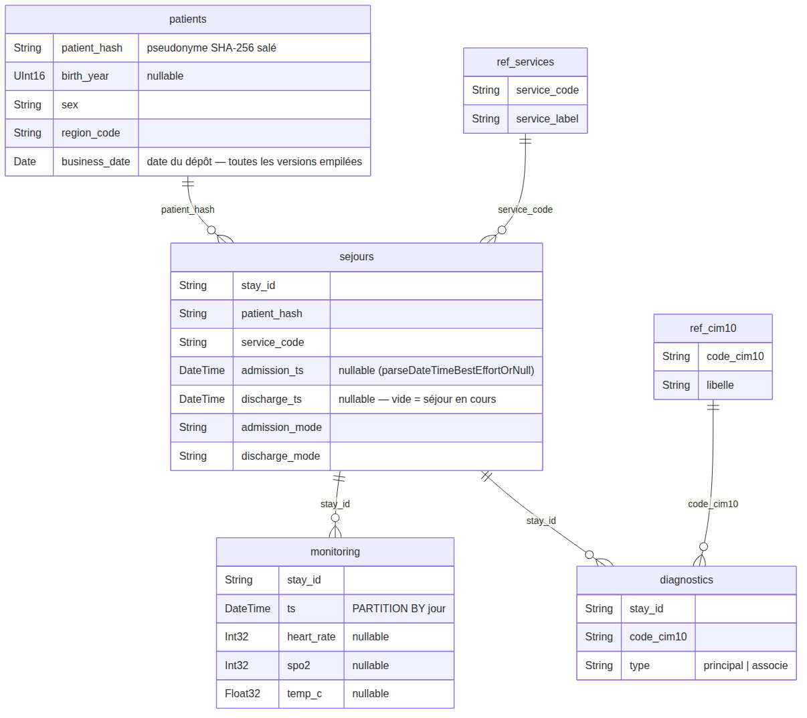

# Couche bronze — le brut, typé

Première couche dans ClickHouse : **une table par source**, peu transformée. On lit
les fichiers du lake, on **type** les colonnes, et c'est tout. Aucun nettoyage,
aucune déduplication, aucun contrôle d'intégrité — ça, c'est le rôle du
[silver](../3_silver/) (et le journal des rejets, celui de [clean](../2_clean/)).



_Source du schéma : [`report/schemas/bronze.mmd`](../../report/schemas/bronze.mmd) ·
régénéré par `make schema`. Les liens sont **logiques** — l'intégrité référentielle
n'est vérifiée qu'à partir du silver._

## Principe

- **Lecture du lake** — le dossier `data/lake/` est monté en lecture seule dans le
  conteneur sous `user_files/lake/` (`docker-compose.yml`). Chaque table se remplit
  via `file('lake/<source>/*/<fichier>', <format>)` ; le `*` couvre les dates de
  dépôt (`AAAA-MM-JJ`) et **tolère un jour absent** (utile pour les référentiels,
  cf. plus bas).
- **Typage = seule transformation** — `toUInt16OrNull`, `toInt32OrNull`,
  `toFloat32OrNull`, `parseDateTimeBestEffortOrNull`. Une valeur illisible devient
  **`NULL`** au lieu de faire échouer l'ingestion ; le tri « bon / mauvais » est
  fait ensuite en silver et tracé dans `clean.rejects`.
- **Rebuild complet** — chaque fichier fait `TRUNCATE` + `INSERT` depuis le lake.
  `make transform` (ou `uv run eds transform --layer bronze`) est donc **rejouable
  sans doublon**.
- **Pas de dépendances entre tables** — les 5 fichiers sont joués dans l'ordre
  alphabétique (`diagnostics`, `monitoring`, `patients`, `referentiels`, `sejours`) ;
  aucune table bronze ne lit une autre.

## Les tables

| Table | Source (format) | Tri / clés | Note |
|---|---|---|---|
| `bronze.patients` | `patients.csv` (CSV pseudonymisé) | `(patient_hash, business_date)` | garde **toutes les versions** du dépôt quotidien + leur `business_date` (extrait du chemin) — la déduplication « version la plus récente » se fait en silver |
| `bronze.sejours` | `sejours.csv` (CSV) | `stay_id` | `admission_ts` / `discharge_ts` en `parseDateTimeBestEffortOrNull` → `discharge_ts` vide reste `NULL` (séjour en cours, légitime) |
| `bronze.monitoring` | `monitoring.parquet` (Parquet, lu nativement) | `(stay_id, ts)`, **`PARTITION BY toYYYYMMDD(ts)`** | flux volumineux ; le partitionnement par jour permet le *partition pruning* ; `heart_rate` / `spo2` / `temp_c` nullables |
| `bronze.diagnostics` | `diagnostics.json` (JSON imbriqué) | `(stay_id, code_cim10)` | `JSONAsString` (1 ligne par séjour) puis `ARRAY JOIN JSONExtractArrayRaw(raw, 'diagnostics')` → 1 ligne = `(stay_id, code_cim10, type)` ; `type` ∈ `principal | associe` |
| `bronze.ref_services` | `referentiels/services.csv` (CSV) | `service_code` | nomenclature `code → libellé` |
| `bronze.ref_cim10` | `referentiels/cim10.csv` (CSV) | `code_cim10` | nomenclature `code → libellé` |

## Points notables

- **`business_date`** — seule `bronze.patients` la conserve, car c'est la seule
  source dédupliquée en silver (`argMax(colonne, business_date) GROUP BY patient_hash`).
  Elle est extraite du chemin du fichier : `extract(_path, '(\d{4}-\d{2}-\d{2})')`.
- **Référentiels déposés le premier jour uniquement** — `file('lake/referentiels/*/…')`
  ne trouve les CSV que sous `2026-08-26/` ; les jours suivants sans dépôt ne sont
  pas une erreur. Ne pas s'attendre à les retrouver chaque jour.
- **`diagnostics`** est la seule source à structure imbriquée : `JSONAsString` lit
  chaque objet du tableau racine tel quel, puis `ARRAY JOIN` aplati le sous-tableau
  `diagnostics`.

## Exécution & vérifications

```bash
uv run eds transform --layer bronze     # rejoue uniquement cette couche
```

Comptes attendus sur le jeu fourni (3 jours, 2026-08-26 → 28) :

```sql
SELECT count() FROM bronze.patients;      -- 16 200  (4 800 + 5 400 + 6 000, versions empilées)
SELECT count() FROM bronze.sejours;       -- 15 000  (5 000 / jour)
SELECT count() FROM bronze.monitoring;    -- ~66 700 (Parquet, réparti sur les partitions jour)
SELECT count() FROM bronze.diagnostics;   -- ~37 400 (15 000 principal + ~22 400 associe)
SELECT count() FROM bronze.ref_services;  -- 8
SELECT count() FROM bronze.ref_cim10;     -- 10

-- répartition des versions patients par date de dépôt
SELECT business_date, count() FROM bronze.patients GROUP BY business_date ORDER BY business_date;
```

## Ce que bronze ne fait PAS

Déduplication, cohérence temporelle, bornes physiologiques, intégrité référentielle,
jointures, agrégation. Tout cela est en aval :

```
lake ──▶ bronze (ici) ──▶ silver (nettoyé, relié) ──▶ gold (KPI)
                              └──▶ clean.rejects (lignes écartées, audit)
```
